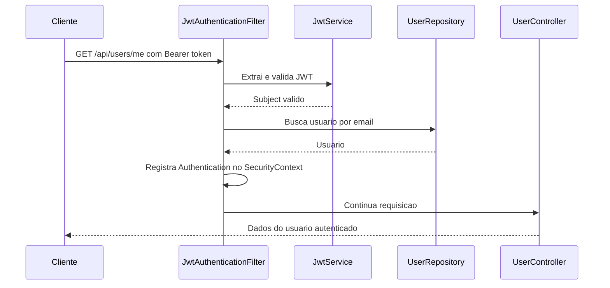
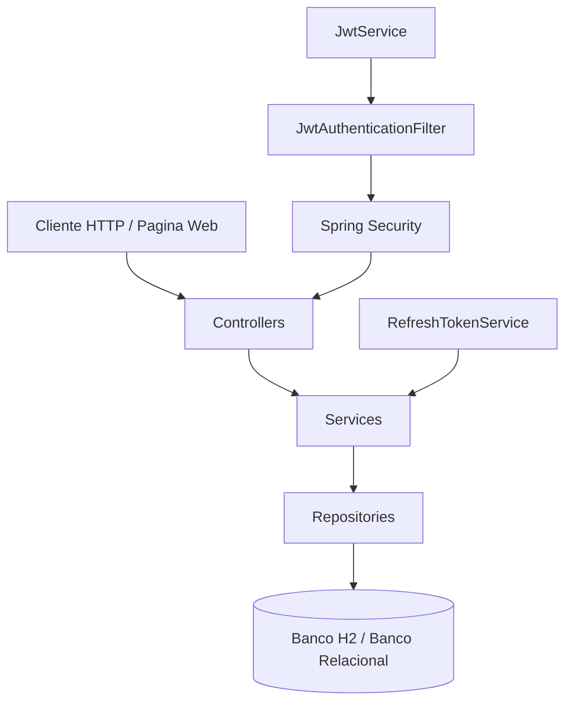

# Arquitetura Do AuthCore

Este documento descreve a arquitetura atual do AuthCore com base no codigo existente no repositorio.

## Visao Geral

O AuthCore segue uma arquitetura em camadas, separando entrada HTTP, regras de negocio, persistencia e seguranca.

```text
Cliente HTTP / Pagina Web
        |
        v
Controller
        |
        v
Service
        |
        v
Repository
        |
        v
Banco de Dados Relacional
```

## Camadas

### Controller

Responsavel por receber requisicoes HTTP, validar os DTOs de entrada e delegar o processamento para os services.

Classes atuais:

- `AuthController`
- `UserController`

### Service

Responsavel pelas regras de negocio da aplicacao.

Classes atuais:

- `AuthService`
- `JwtService`
- `RefreshTokenService`

### Repository

Responsavel pelo acesso ao banco de dados via Spring Data JPA.

Interfaces atuais:

- `UserRepository`
- `RefreshTokenRepository`

### DTOs

Responsaveis por representar contratos de entrada e saida da API.

DTOs atuais:

- `RegisterRequest`
- `LoginRequest`
- `RefreshTokenRequest`
- `LogoutRequest`
- `AuthResponse`
- `UserResponse`

### Security

Responsavel por configurar o Spring Security, validar access tokens JWT e autenticar requisicoes protegidas.

Classes atuais:

- `SecurityConfig`
- `JwtAuthenticationFilter`
- `JwtService`
- `UserPrincipal`

## Pacotes Principais

```text
com.example.jwtapi
|-- api
|-- auth
|-- security
`-- user
```

| Pacote | Responsabilidade |
| --- | --- |
| `api` | Tratamento global de excecoes da API. |
| `auth` | Endpoints, DTOs e regras de autenticacao. |
| `security` | JWT, refresh token, filtro e configuracao de seguranca. |
| `user` | Entidade, repositorio e endpoint do usuario autenticado. |

## Fluxo De Requisicao Protegida



## Diagrama De Arquitetura

O diagrama visual esta em:

- `docs/diagramas/arquitetura.png`

Versao Mermaid:



## Decisoes Arquiteturais

- O `JwtService` permanece responsavel apenas pelo access token JWT.
- O refresh token possui service proprio para geracao, hash, validacao, revogacao e rotacao.
- O refresh token nao e JWT.
- A autenticacao continua stateless.
- O controle de acesso administrativo usa roles do Spring Security.
- O banco atual e H2 em memoria, mantendo compatibilidade com bancos relacionais via JPA.

## Pontos Em Evolucao

- Banco relacional externo, como PostgreSQL, ainda e planejado.
- Documentacao OpenAPI/Swagger ainda e planejada.
