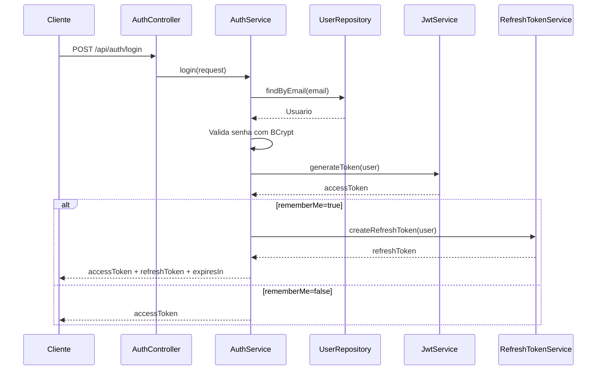

# Autenticacao

Este documento descreve o fluxo de autenticacao atual do AuthCore.

## Modelo Atual

O AuthCore utiliza autenticao baseada em:

- E-mail e senha para login.
- BCrypt para comparacao de senha.
- Access token JWT para acessar rotas protegidas.
- Refresh token opcional quando `rememberMe=true`.
- Roles `USER` e `ADMIN` para autorizacao.

## Endpoints

| Metodo | Endpoint | Descricao |
| --- | --- | --- |
| `POST` | `/api/auth/register` | Cadastra usuario e retorna access token. |
| `POST` | `/api/auth/login` | Autentica usuario e retorna tokens conforme `rememberMe`. |
| `POST` | `/api/auth/refresh` | Rotaciona refresh token e retorna novos tokens. |
| `POST` | `/api/auth/logout` | Revoga refresh token. |
| `GET` | `/api/users/me` | Retorna usuario autenticado. |
| `POST` | `/api/admin/bootstrap` | Cria o primeiro administrador. |
| `GET` | `/api/admin/users` | Lista usuarios para administradores. |
| `PATCH` | `/api/admin/users/{userId}/role` | Altera role de usuario. |

## Cadastro

Request:

```json
{
  "name": "Usuario Teste",
  "email": "user@email.com",
  "password": "123456"
}
```

Resposta atual:

```json
{
  "accessToken": "..."
}
```

Durante o cadastro:

1. O e-mail e normalizado para minusculo.
2. A API verifica se o e-mail ja existe.
3. A senha e criptografada com BCrypt.
4. O usuario e persistido.
5. Um access token JWT e retornado.

## Login

Request:

```json
{
  "email": "user@email.com",
  "password": "123456",
  "rememberMe": true
}
```

Quando `rememberMe=false`, a resposta contem apenas:

```json
{
  "accessToken": "..."
}
```

Quando `rememberMe=true`, a resposta contem:

```json
{
  "accessToken": "...",
  "refreshToken": "...",
  "expiresIn": 900
}
```

## Access Token

O access token e um JWT gerado pelo `JwtService`.

Configuracao atual:

```properties
app.jwt.expiration=900000
```

Isso representa 15 minutos.

Claims atuais:

- `sub`: e-mail do usuario.
- `userId`: identificador do usuario.
- `name`: nome do usuario.
- `role`: role atual do usuario.
- `iat`: data de emissao.
- `exp`: data de expiracao.

## Rota Protegida

Para acessar rotas protegidas, o cliente deve enviar:

```http
Authorization: Bearer ACCESS_TOKEN
```

Exemplo:

```bash
curl http://localhost:8080/api/users/me \
  -H "Authorization: Bearer YOUR_ACCESS_TOKEN"
```

## Rotas Administrativas

Rotas administrativas exigem access token de usuario com role `ADMIN`.

Exemplo:

```bash
curl http://localhost:8080/api/admin/users \
  -H "Authorization: Bearer ADMIN_ACCESS_TOKEN"
```

Usuarios com role `USER` recebem `403 Forbidden`.

## Fluxo De Login

O diagrama visual esta em:

- `docs/diagramas/fluxo-login.png`

Versao Mermaid:



## Tratamento De Erros

Credenciais invalidas retornam `401`.

Exemplo:

```json
{
  "timestamp": "2026-06-12T03:00:00Z",
  "status": 401,
  "error": "Unauthorized",
  "message": "Credenciais invalidas."
}
```
